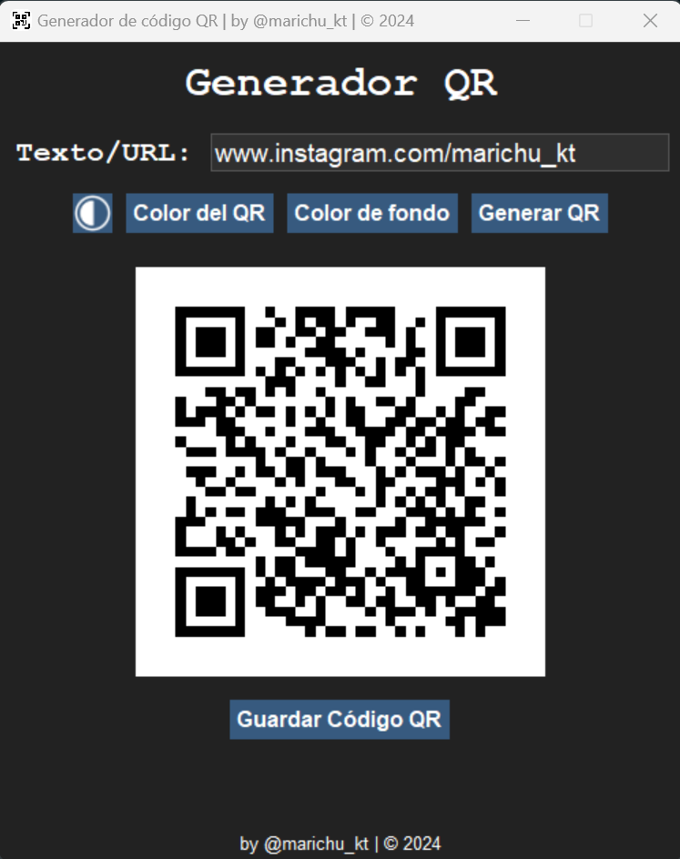
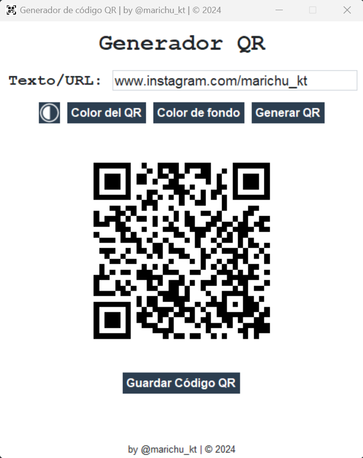

# 🎨 Generador de Códigos QR en Python 🐍

¡Bienvenido al **Generador de Códigos QR**! 📱✨ Este proyecto es una aplicación interactiva construida con **Python** y **Tkinter**, que te permite generar códigos QR personalizados de forma sencilla. 😎

## 🚀 Funcionalidades
- 🖌️ **Personalización de colores**:
  - Cambia el **color del QR** a tu gusto. 🎨
  - Personaliza el **color de fondo** del QR. 🌈
- 🌗 **Modos de visualización**:
  - Alterna entre **modo oscuro** 🌙 y **modo claro** ☀️ con un solo clic.
- 💾 **Guardado de códigos QR**:
  - Guarda los códigos QR generados en tu dispositivo en formato `.png`. 🖼️
- ✍️ **Generación de QR desde texto o enlaces**:
  - Convierte cualquier texto o enlace en un código QR en segundos. 🔗➡️📷

## 🖥️ Capturas de Pantalla
**Modo oscuro** 🌙:

**Modo claro** ☀️:

## 🛠️ Requisitos
- Python 3.6 o superior 🐍
- Librerías necesarias:
  - `tkinter` (viene por defecto en Python)
  - [`ttkbootstrap`](https://ttkbootstrap.readthedocs.io/) 🎨
  - [`Pillow`](https://python-pillow.org/) 🖼️
  - [`qrcode`](https://github.com/lincolnloop/python-qrcode) 📷
